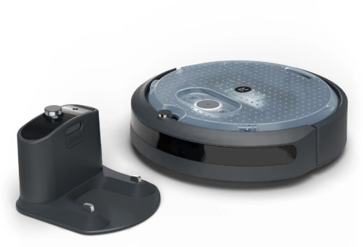
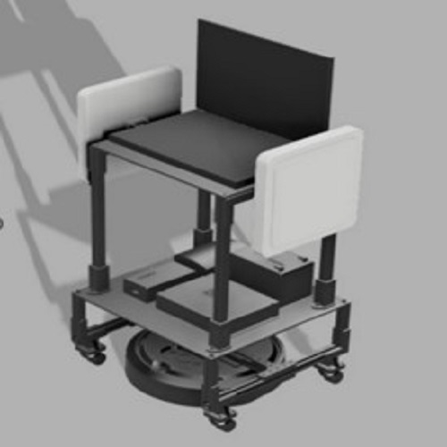
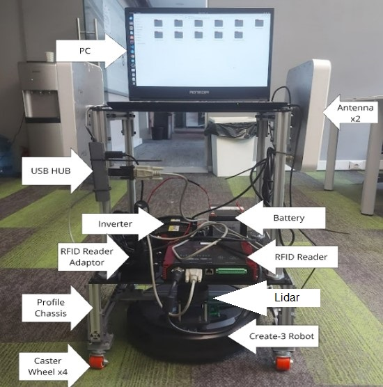

## Contents
1. [Introduction](#introduction)
2. [Mechanical Design](#mechanical-design)
3. [Physical System](#physical-system)
4. [Process Flow Diagram](#process-flow-diagram)
5. [Installation](#installation)
6. [Usage](#usage)
7. [Results](#results)
8. [Contact](#contact)

## Introduction
In the study, the Create-3 robot, produced by IRobot for ROS2 developers and capable of differential drive, was used. An RFID system was installed on the robot, and the counting processes were carried out through this system.
<p align="center">
  
</p>
<p align="center">IRobot Create-3</p>

## Mechanical Design ##
The Create-3 robot, designed as a training robot, is used for enabling movement at the base. A skeleton structure is built for the assembly of the robot's hardware. This skeleton is made using sigma profiles due to its durability and cost-effectiveness. For the intermediate layers of the skeleton, plexiglass sheets are used. The connection elements include knurled nuts and connection components produced with a 3D printer. The robot's skeleton design was created on Fusion 360, and the hardware components were drawn according to the dimensions of each part and assembled into the skeleton design.
The design of the study was carried out on Fusion 360. After the design, the production phase used aluminum profiles for the skeleton structure, and black plexiglass sheets were used for the intermediate layers.
<p align="center">
  
</p>
<p align="center">Design</p>

## Physical System ##
The profiles were cut according to the dimensions drawn in the Fusion 360 program, and the skeleton was created. The RFID system was then built onto this skeleton.
<p align="center">
  
</p>
<p align="center">Physical System</p>

## Process Flow Diagram
The Inventory Counting Robot must perform a series of tasks sequentially. There are tasks that need to be done in both serial and parallel. The first task for the robot is to establish communication between the Create-3 and the PC. To confirm that the communication is working properly, it is observed that the topics, services, actions, and parameters are coming through correctly on the PC. After these steps, the hardware connections for the lidar and RFID system are established. Once the hardware setup is complete, the software processes begin. First, the lidar driver package is activated. Since the legs of the lidar skeleton are perceived as obstacles, a laser filtering file is executed to filter that area. Next, the map obtained from the SLAM software is provided as a parameter, and the navigation software is activated, giving the robot its initial position. After setting the robot's starting position, the two software systems are started in parallel. The first one involves a pre-existing file with target points where the robot needs to go and return to the starting point. The second one is the publisher node that communicates with the inventory reader via serial communication and publishes the data it reads from the serial port for the bag record. Once the robot returns to the starting point, the navigation and counting tasks are completed.
<p align="center">
  
</p>
<p align="center">Process Flow Diagram</p>

## Installation

```bash

### Necessary Package Installation 

sudo apt install ros-humble-rplidar-ros

sudo apt install ros-humble-navigation2

sudo apt install ros-humble-nav2-bringup

sudo apt install ros-humble-turtlebot3*

sudo apt install ros-humble-slam-toolbox


### Create a ROS2 workspace

mkdir -p ~/counting_ws/src

cd ~/counting_ws/src

### Clone the repository

git clone https://github.com/MehmetZekiSildir/Inventory-Counting-Robot-with-ROS2.git

### Navigate to the workspace and build the project

cd ~/counting_ws

colcon build

#### Source the workspace

source install/setup.bash

## Usage
Projenin nasıl kullanılacağı anlatılacaktır.


## Results
Elde edilen sonuçlar burada paylaşılacaktır.

## Contact
İletişim bilgileri burada yer alacaktır.
